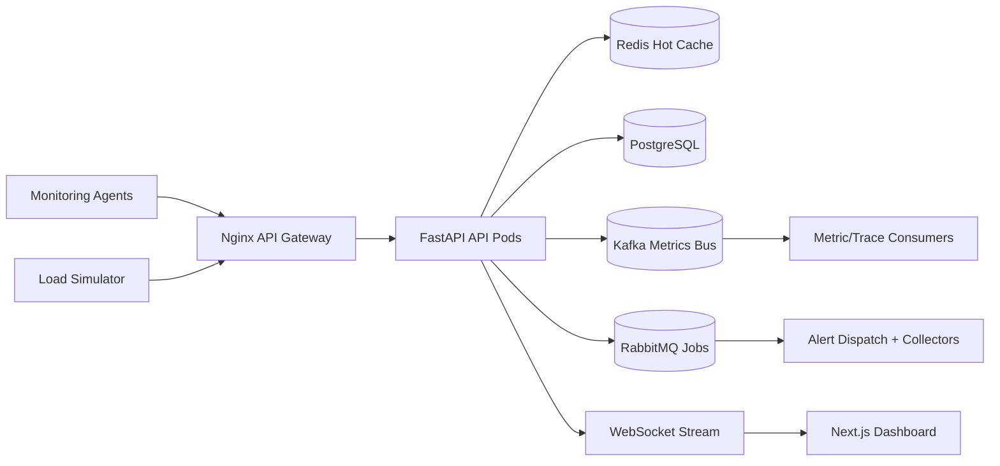

# Architecture

## High-level design

## Data ingestion architecture

1. Agents and synthetic load generators send metrics, logs, and traces to versioned ingest endpoints.
2. FastAPI validates payloads, applies rate limiting, persists hot-path writes, and publishes event copies into Kafka.
3. Redis stores short-lived aggregates for dashboard queries and frequent panels.
4. Alert rules are evaluated on write; triggered incidents are queued into RabbitMQ for async email/Slack/webhook fan-out.
5. WebSocket clients receive push updates for new metrics, alerts, and logs.

## Event streaming pipeline

- `metrics.ingest`: high-volume metric stream for rollups, anomaly detection, and downstream ML.
- `logs.ingest`: structured application and infrastructure logs.
- `traces.ingest`: trace spans for service graph reconstruction.
- RabbitMQ queues:
  - `alerts.dispatch`: notification jobs.
  - `simulator.runs`: async simulator bookkeeping.

## Database schema summary

- `users`: auth identities and RBAC roles.
- `services`: monitored endpoints, databases, and services.
- `metric_points`: time-series metric data keyed by service and timestamp.
- `alert_rules`: threshold policies and delivery channels.
- `alert_events`: incident history with open/resolved state.
- `trace_spans`: distributed tracing spans and relationships.
- `log_entries`: structured logs with optional trace correlation.
- `simulation_scenarios` and `simulation_runs`: system design playground metadata and outputs.

## Sharding and scaling strategy

- Partition `metric_points` and `log_entries` by day or hour using native PostgreSQL partitioning or TimescaleDB hypertables.
- Shard by `service_id` or tenant key once a single cluster approaches storage or write amplification limits.
- Scale API servers horizontally behind Nginx or a cloud L7 load balancer.
- Scale Kafka consumers by increasing partitions and consumer group members.
- Scale RabbitMQ workers independently from ingest throughput.

## Monitoring agent design

- Each agent samples local CPU and memory via `psutil`.
- External reachability and latency are measured by probing a target URL.
- The agent batches payloads, tags them with host metadata, and authenticates using an API key.
- Production deployments should add retries, jitter, TLS pinning, service discovery integration, and buffered disk spooling.

## API design

- `POST /api/v1/auth/login`
- `POST /api/v1/services`
- `GET /api/v1/services`
- `POST /api/v1/metrics/ingest`
- `GET /api/v1/metrics`
- `GET /api/v1/alerts`
- `POST /api/v1/alerts`
- `POST /api/v1/logs/ingest`
- `GET /api/v1/logs`
- `POST /api/v1/traces/ingest`
- `GET /api/v1/traces/{trace_id}`
- `GET /api/v1/simulator/scenarios`
- `POST /api/v1/simulator/runs`
- `WS /api/v1/ws/stream`

## Fault tolerance

- Stateless API servers support blue/green or rolling deployment.
- Redis failures degrade cache hit rate, not durability.
- Kafka retains streams for replay and downstream recomputation.
- RabbitMQ decouples notifications from ingest latency.
- PostgreSQL should run with streaming replicas and point-in-time recovery in production.
